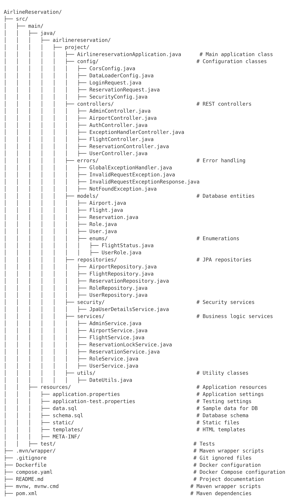
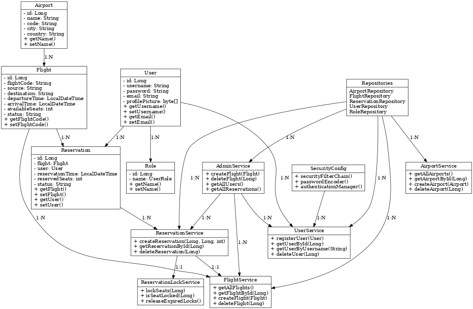
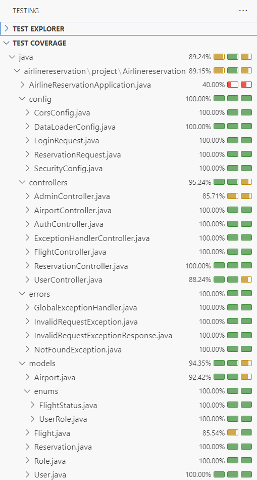

<!--Airline-->

<!--Title-->

<strong><samp>「</samp></strong>

<b>Airline_Reservation</b>
   
       
   
<b>    
  ✈️The Airline_Reservation project is a comprehensive RESTful API designed for managing an airline's operations, including user management, flight scheduling, reservation handling, and destination management. The system incorporates advanced features such as secure authentication Basic Auth and ensures flight availability is accurately maintained. The project emphasizes clean architecture and object-oriented programming principles to deliver a robust and maintainable system.The system guarantees that no bookings can be made for unavailable flights or those exceeding their operational dates.✈️
</b>

<strong><samp>」</samp></strong>

   
   
   

## ✅Features Overview

# User Management
 - Role-Based Access Control: Includes ROLE_ADMIN and ROLE_USER for access differentiation.
 - User Registration: Allows users to sign up with personal information.
 - Profile Picture Upload: Users can upload a profile picture; a default image is shown otherwise.
 - User Login: Secure login with Basic Auth for API access.
# Flight Management
 - Flight Scheduling: Automatic creation of flight data during initialization via SQL scripts.
 - Dynamic Status Updates: Automatically marks flights as unavailable (false) when seats are fully booked or dates are invalid.
 - Search Functionality: Search flights by departure and arrival locations, date, and available seats.
# Reservation Management
 - Booking Validation: Ensures reservations can only be made for available flights.
 - Seat Locking: Locks seats for 15 minutes during booking to prevent double-booking.
 - User-Specific Reservations: Allows users to view their reservation history.
# Admin Management
 - CRUD for Airports: Manage airport data.
 - CRUD for Flight Routes: Add, update, delete, and view flight routes.
 - Reservation Overview: View a summary of reservations made by users.
# Exception Handling
 - Custom Exception Handling: Ensures a seamless user experience with detailed error messages.

## ✅Prerequisites

 - Java Development Kit (JDK) 21: Required to compile and run the project.
 - Maven: For dependency management and project build.
 - Database: DBeaver 24.3.2 for data storage.
 - IDE: A modern IDE like IntelliJ IDEA or Eclipse.
 - Docker: For containerization.
  
## ✅Installation Steps

1 Clone the repository:

 ``https://github.com/Snysic/Airline_Reservation.git``

2 Set up the project in your IDE:

- Open the project in your preferred IDE.
- Ensure JDK 21 is configured.
- Verify the presence of the pom.xml file.
  
3 Configure the database:

 - For DBeaver 24.3.2, update application.properties with the appropriate database URL, username, and password.

4 Run the application:

- Navigate to the AirlineReservationApplication class.
- Run the project to start the server.
  
5 Access the application:

- Open your browser and navigate to http://localhost:8080.
  
  ## 📂Project Structure

The project follows the principle of separation of concerns, using three main layers:
- Controllers: Handle HTTP requests.
- Services: Manage business logic.
- Repositories: Interact with the database.

DTOs are used for data transfer between layers, and global exception handling ensures consistent error responses. Custom exceptions are employed for domain-specific errors, making the codebase maintainable, scalable, and easy to extend.

## ✅API Endpoints

User Management
- Register a User:
POST http://localhost:8080/api/users/register

- Login:
POST http://localhost:8080/api/users/login

- Upload Profile Picture:
POST http://localhost:8080/api/users/profile/upload

- Get User Reservations:
GET http://localhost:8080/api/users/reservations

Flight Management
- Search Flights:
GET http://localhost:8080/api/flights/search

- Get Flight Details:
GET http://localhost:8080/api/flights/{id}

Reservation Management
- Create a Reservation:
POST http://localhost:8080/api/reservations

- Cancel a Reservation:
DELETE http://localhost:8080/api/reservations/{id}

Admin Management
- CRUD for Airports:
- POST http://localhost:8080/api/admin/airports
- PUT http://localhost:8080/api/admin/airports/{id}
- DELETE http://localhost:8080/api/admin/airports/{id}
- GET http://localhost:8080/api/admin/airports

- CRUD for Flight Routes:
- POST http://localhost:8080/api/admin/routes
- PUT http://localhost:8080/api/admin/routes/{id}
- DELETE http://localhost:8080/api/admin/routes/{id}
- GET http://localhost:8080/api/admin/routes

## ✅Testing

- Unit Tests: Ensure core functionalities are tested.
- Integration Tests: Validate end-to-end workflows.

Running Tests
Run the test suite in your IDE or use Maven:

mvn test
Review test coverage reports.

## ✅Technology Stack

 

## ✅Class Diagram

## ✅Coverage

## ✅Author

Maria V 

## ✅Disclaimer

This project is developed as part of the Factoría F5 bootcamp for educational purposes only. It is not intended for commercial use. All trademarks and third-party references belong to their respective owners.